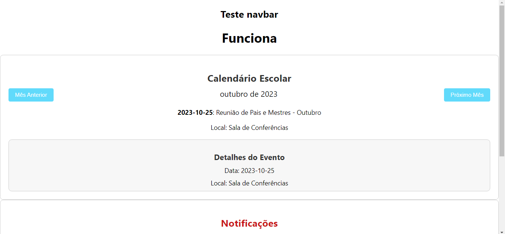

# Gerenciamento Escolar

Um sistema de gerenciamento escolar desenvolvido em React.js.

## Capturas de Tela



## Instalação

Para instalar e executar o projeto, siga estes passos:

```bash
npm install
npm start
